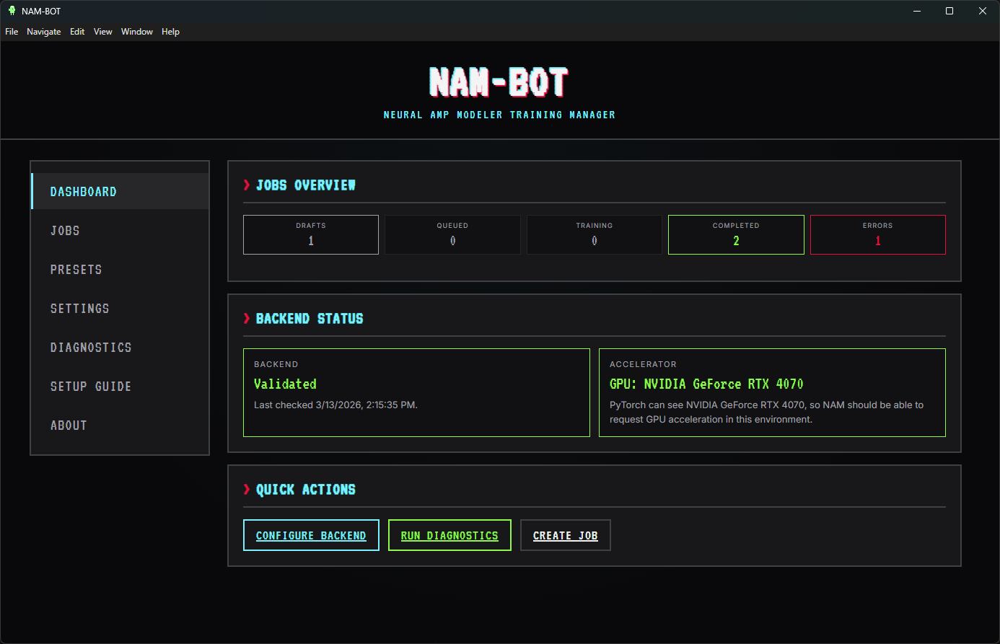
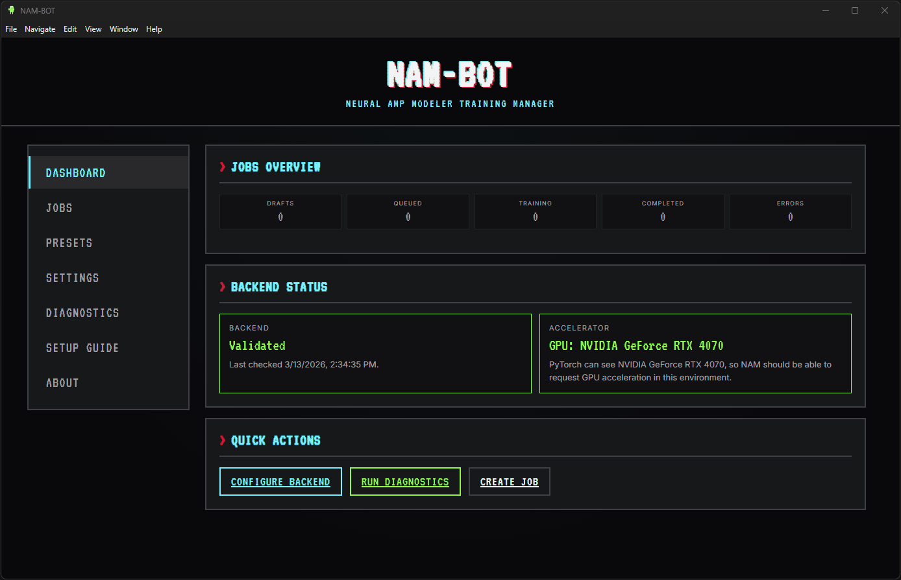
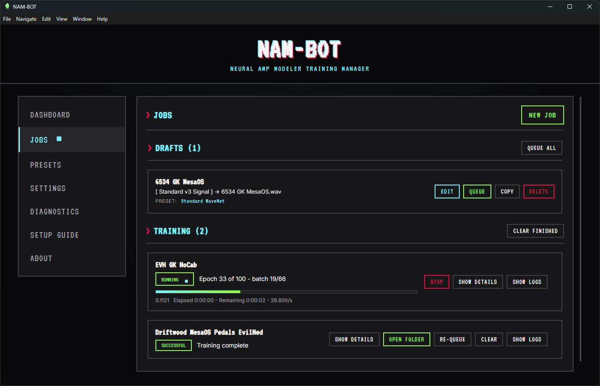
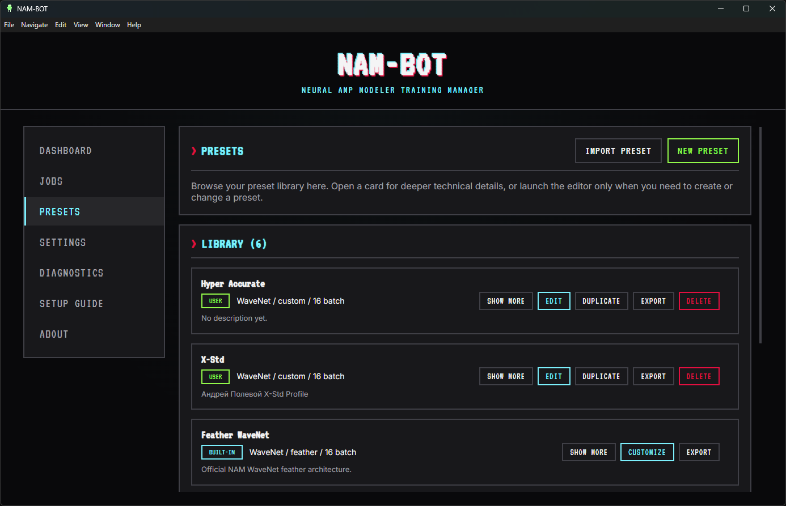

# NAM-BOT

<p align="center">
  
</p>

<p align="center">
  Desktop control room for local Neural Amp Modeler training.
</p>

NAM-BOT is an Electron desktop app that wraps the local Neural Amp Modeler training workflow in a friendlier UI. It is meant to keep the fun, tinkery side of local NAM training alive while making the process less intimidating for people who do not want to live in a terminal just to get started.

If you do not already have NAM installed locally, NAM-BOT is also meant to help you get there. The app includes setup guidance and diagnostics that walk you through the steps to get a working local NAM environment up and running.

One of the most fun parts of NAM-BOT is that presets are not trapped on one machine. You can export and import training presets to share setups with other people, including creator name and creator URL metadata so the preset can carry attribution and a link back to its source.



## Why I Built This

I originally got pulled into Neural Amp Modeler through exactly the kind of open-source rabbit hole that makes a project stick with you. I loved the public repos, the command-line workflow, the feeling of learning by doing, and the fact that the NAM community felt generous and genuinely supportive.

These days, I often use Tone 3000 because it is fast, polished, and sounds great. But I still missed some of that DIY experimentation, especially the ability to push into bigger or weirder local training setups just because it is interesting to try.

NAM-BOT came out of that feeling. I wanted a desktop app that made local NAM training more approachable without sanding off the curiosity that makes this space fun in the first place.

The goal is not to replace the deeper hands-on side of NAM. It is to give you a more comfortable launch point into it, whether you already know your way around Python and Conda or you are still figuring out what any of that means.

## What It Tries To Do

NAM-BOT tries to make local training smoother by giving you:

- A desktop UI for creating, queueing, and monitoring NAM training jobs
- Reusable presets you can export, import, and share with creator metadata
- Guided setup help for people who are newer to the NAM and Python side
- Diagnostics that explain backend and accelerator problems in plain language
- Live training logs without needing to camp in a terminal window

## What You Can Do

- Queue multiple training jobs and track status from a dashboard
- Save and reuse training presets across runs
- Export and import presets for sharing, including creator name and URL metadata
- Point the app at either a Conda environment or a direct Python executable
- Validate backend setup before launching jobs
- Inspect CUDA, MPS, Lightning, and host GPU visibility from Diagnostics
- Review live terminal output while a job is running

## Platform And Requirements

**Windows**

- Windows 10 or Windows 11, x64
- [Miniconda or Anaconda](https://www.anaconda.com/download), unless you already run NAM another way
- A Python environment with `neural-amp-modeler` installed
- NVIDIA GPU recommended if you want faster local training

**macOS (beta)**

- Apple Silicon (`arm64`) and Intel (`x64`) builds are available as separate DMGs
- Use Terminal and the `conda` command rather than Command Prompt / PowerShell and `conda.exe`
- Apple Silicon users should choose Apple Silicon Miniconda and expect MPS diagnostics rather than CUDA-first messaging
- Current macOS DMGs are unsigned beta builds and may require right-click `Open` on first launch

## Install

For a public repository, the typical user-friendly path is:

1. Open the GitHub Releases page.
2. Download the latest Windows installer if you are on Windows, or the matching `arm64` / `x64` DMG if you are on macOS.
   Windows installer example: `NAM-BOT-Setup-0.4.0-Win64.exe`
   macOS beta examples: `NAM-BOT-0.4.0-macOS-beta-arm64.dmg` or `NAM-BOT-0.4.0-macOS-beta-x64.dmg`
3. Run the installer on Windows, or open the DMG and move NAM-BOT into Applications on macOS.

## Setup Overview

When NAM-BOT starts, it looks for Conda on your system `PATH` and assumes the default Conda environment name `nam`.

If it finds both of those and your local NAM install is healthy, you are usually ready to go right away. Open the app, confirm the checks pass, and start training.

### If You Already Have NAM Working

If you already train NAM models outside NAM-BOT, you usually do not need to rebuild your Python environment.

1. Open `Settings`.
2. If NAM-BOT already found Conda on `PATH` and your environment is named `nam`, you may not need to change anything at all.
3. Otherwise, point NAM-BOT at the same Conda environment, environment path, or Python executable you already use.
4. Open `Diagnostics` and confirm backend validation and accelerator checks pass.
5. Start training.

### If You Need To Install NAM Locally

If you do not already have a local NAM environment, NAM-BOT will help walk you through it. The expected quick-start path is:

1. Install Miniconda or Anaconda.
2. Create a Conda environment named `nam`.
3. Install `neural-amp-modeler` into that environment.
4. Open NAM-BOT and let Diagnostics confirm the setup.

On macOS, use Terminal for those commands. On Apple Silicon, choose the Apple Silicon Miniconda installer and treat MPS as the expected accelerator path.

### Manual Setup Reference

If you want to build the environment by hand, these are the commands NAM-BOT expects most people to start from:

```bash
conda create -n nam python=3.11 -y
conda activate nam
pip install neural-amp-modeler
```

### If You Need CUDA Training

If you have an NVIDIA GPU and want faster local training, replace the default PyTorch build with a CUDA-enabled build in that same environment:

```bash
conda activate nam
pip uninstall -y torch
pip install --index-url https://download.pytorch.org/whl/cu130 --no-cache-dir torch==2.10.0+cu130
python -c "import torch; print(torch.__version__); print(torch.version.cuda); print(torch.cuda.is_available()); print(torch.cuda.get_device_name(0) if torch.cuda.is_available() else None)"
```

Expected result:

- `torch.__version__` includes `+cu130`
- `torch.version.cuda` is not `None`
- `torch.cuda.is_available()` returns `True`

After that, launch NAM-BOT, fill in `Settings` only if needed, and use `Diagnostics` to confirm the app sees the same backend and GPU state.

### If You Have an AMD GPU (ROCm, Windows Only)

If you have an AMD Radeon GPU (RX 7000, RX 9000, or PRO W7000 series) on Windows, you can use ROCm-enabled PyTorch for GPU-accelerated training. NAM-BOT will automatically detect ROCm and display "ROCm (AMD) GPU is visible" in Diagnostics.

**Requirements:**

- Windows 10 or Windows 11
- AMD Radeon RX 7000, RX 9000, or PRO W7000 series GPU
- **Python 3.12** (strictly required for official ROCm wheels)
- AMD ROCm PyTorch wheels from the official AMD repository

**Setup Steps:**

1. Create a Python 3.12 Conda environment:

```bash
conda create -n nam python=3.12 -y
conda activate nam
```

2. Install the ROCm SDK core package:

```bash
pip install --no-cache-dir https://repo.radeon.com/rocm/windows/rocm-rel-7.2/rocm_sdk_core-7.2.0.dev0-py3-none-win_amd64.whl
```

3. Install ROCm-enabled PyTorch:

```bash
pip install --no-cache-dir https://repo.radeon.com/rocm/windows/rocm-rel-7.2/torch-2.9.1%2Brocmsdk20260116-cp312-cp312-win_amd64.whl
```

4. Install Neural Amp Modeler:

```bash
pip install neural-amp-modeler
```

5. Verify ROCm installation:

```bash
python -c "import torch; print('CUDA Available:', torch.cuda.is_available()); print('HIP Version:', torch.version.hip)"
```

Expected result:

- `CUDA Available:` returns `True`
- `HIP Version:` shows a version string (e.g., `7.2.x`)
- `torch.version.cuda` is `None` (this is normal for ROCm builds)

**Notes:**

- ROCm PyTorch uses the CUDA API internally via HIP, so `torch.cuda.is_available()` returns `True` even though you have an AMD GPU
- NAM-BOT detects the difference by checking `torch.version.hip` and displays "ROCm (AMD) GPU is visible" in Diagnostics
- macOS does not support ROCm; Intel Mac users must use CPU-only training
- For the latest ROCm versions and compatibility, see the [AMD ROCm documentation](https://rocm.docs.amd.com/projects/radeon-ryzen/en/latest/docs/install/installrad/windows/install-pytorch.html)

After setup, launch NAM-BOT and use `Diagnostics` to confirm "ROCm (AMD) GPU is visible" before training.

## Diagnostics

The Diagnostics panel is there to do more than just tell you pass or fail.

It checks a few predetermined paths first, including:

- Whether NAM-BOT can actually reach Conda
- Whether the selected environment is reachable
- Whether Python, NAM, torch, CUDA / MPS, and Lightning look healthy inside that environment
- Whether the host machine itself exposes an NVIDIA GPU when CUDA-oriented checks apply

When it spots a likely GPU or environment problem, it gives you ready-to-paste commands for the most common fix paths. That covers a lot of the usual Windows, Conda, and torch mismatch issues without making you search around manually.

If the built-in guidance is not enough, the Diagnostics panel can also generate a ready-to-paste troubleshooting prompt and raw diagnostics export with system and environment details included. You can drop that into an LLM like Claude or ChatGPT and get much more targeted help without having to manually explain your setup from scratch.

## Typical Workflow

1. Open `Jobs`.
2. Drag in your source audio or create a new job manually.
3. Save the job draft.
4. Queue it.
5. Monitor progress from the Dashboard and Jobs screens.

## Preset Sharing

Presets are more than saved defaults. NAM-BOT lets you export a training preset, send it to someone else, and import theirs into your own library.

That makes it much easier to trade training recipes with other NAM users while keeping useful context attached. Creator name and creator URL metadata can travel with the preset, so people can see who made it and where to find more info.

## In Action

Creating and queueing a new job:



Jobs screen with drafts, active training, and history:



Presets library:



## Documentation

- [Diagnostics Screen](./docs/diagnostics.md)
- [Settings Guide](./docs/settings.md)
- [Jobs System](./docs/jobs-system.md)
- [Presets System](./docs/presets-system.md)
- [Desktop Shell](./docs/desktop-shell.md)

## License

MIT. See [LICENSE.md](./LICENSE.md).
